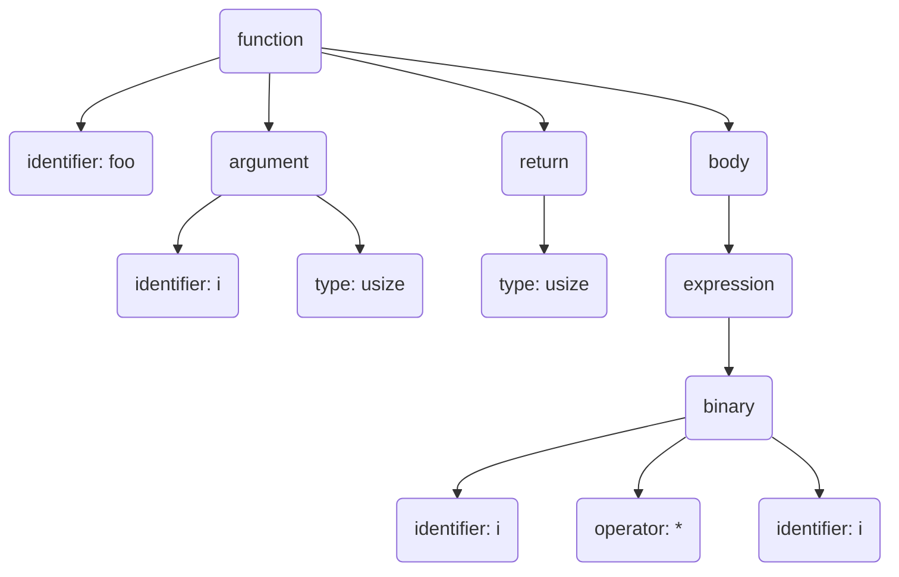

+++
title = "Parsing with Rust - Part 1: a crash-course"
date = "2023-03-14"
author = "John"
authorTwitter = "jdidion" #do not include @
tags = ["rust", "parsing", "wdl"]
keywords = ["rust", "parsing", "wdl"]
description = ""
showFullContent = false
readingTime = false
hideComments = false
color = "" #color from the theme settings
+++

The first post in a series on writing programming-language parsers in Rust. This post gives a high-level introduction to parsing, discusses different types of grammars and parsers, and gives an overview of the most popular Rust crates for generating a parser from a grammar. In future posts, we'll dive deep into implementing parsers for [WDL](https://openwdl.org), a domain-specific language for describing computational workflows.

<!--more-->

## An introduction to parsing

A [compiler](https://en.wikipedia.org/wiki/Compiler) is a program that translates code written in a high-level language (e.g., Rust) from a string of text into executable machine code[^1]. There are [many steps](https://rustc-dev-guide.rust-lang.org/syntax-intro.html) involved in compiling a program, and different compilers work in different ways, but the first step (after any preprocessing) is to transform the source code string into a tree structure called an abstract syntax tree (AST). Generally, each node in the AST maps to a syntactic element of the language, and the terminal nodes are called tokens.

In the example below, the `function` node maps to the entire function definition, and each syntax element within the function definition maps to a node that is a descendant of `function`. The `identifier`, `type`, and `operator` nodes are terminal nodes that each map to a single token.

```rust{title="A simple Rust program"}
fn foo(i: usize) -> usize {
  i * i
}
```



The process that executes this first step of compilation is called a *parser*. A parser consists of two stages that may be performed separately or in a single pass:

1. Lexical analysis (or *lexing*): transforming the source code string into a series of tokens, each of which corresponds to one of the keywords, symbols, identifiers, or literal values that make up a valid program.
2. Syntactic analysis (or *parsing*): splitting the token stream into groups of tokens, each of which describes a syntactic element and is translated into a node in the AST.

Now let's say that we want to write a parser for our favorite language. How do we go about it? There are two approaches: write the parser manually or create it automatically using a *parser generator*. Hand-written [lexers](https://doc.rust-lang.org/stable/nightly-rustc/rustc_lexer/index.html) and [parsers](https://doc.rust-lang.org/stable/nightly-rustc/rustc_parse/index.html) can be (much) faster than the alternative, but they are also complex and labor-intensive. On the other hand, generated parsers only require you to describe the language as a [formal grammar](https://en.wikipedia.org/wiki/Formal_grammar) in whatever *meta-language* is supported by the parser generator.

In this series of posts, we'll be focusing on the second approach[^2]. We'll first cover the different flavors of formal grammar you might encounter, and then we'll close with an overview of parser generators that either generate Rust code or provide Rust bindings.

## Formal grammars

A [formal language](https://en.wikipedia.org/wiki/Formal_language) is one that is defined by rules, such as which alphabet is used to write its words, which words are considered valid, and how sentences are structured. A [formal grammar](https://en.wikipedia.org/wiki/Formal_grammar) is an encoding of a formal language's rules and can be used to generate strings that are valid in that language.

For example, below is a grammar for a very simple language that can generate strings such as "The man jumps." Each rule (technically called a *production rule*) has a unique identifier on the left-hand-side and an ordered list of productions on the right-hand-side, where each production is either a token or another rule. The grammar also makes use of a choice operator (`|`) that defines a set of alternative productions from which exactly one must be selected.

```text{title="A simple grammar"}
Sentence -> "The" {Noun} {Verb} "."
Noun -> ( "man" | "woman" | "child" )
Verb -> ( "runs" | "jumps" | "falls" )
```

For some languages, a grammar can also form the basis for a function that determines whether a given string is valid (called a *recognizer*) and may be translated into a parser. Using our example grammar above, our parser might operate as follows:

1. Break up the string "The man jumps." by splitting on whitespace and punctuation, resulting in the tokens `["The", "man", "jumps", "."]`.
2. Try to match the first token to the first production of one of the rules of the grammar. The token `"The"` matches a single rule, `Sentence`.
3. Try to match the next input token to the next production of the `Sentence` rule. The next production is a rule (`Noun`), so it is "expanded" by substituting the right-hand-side of that rule. The token `"man"` matches one of the alternatives of `Noun`'s production.
4. Similarly, `"jumps"` is matched to one of the alternatives of `Verb`'s production.
5. Finally, the last token `"."` is matched to the last of `Sentence`'s productions.

Note that a grammar only defines the *syntax* of a language. A string that is syntactically valid (i.e., it conforms to the rules of the language) must undergo further *semantic* analysis to determine whether it has a valid meaning. For example, both of the Python programs below are syntactically valid, but only the second one is semantically valid.

```python{title="Valid syntax, invalid semantics"}
i = 0
k = i + j # invalid reference to identifier `j`
```

```python{title="Valid syntax and semantics"}
i = 0
j = 1
k = i + j
```

Parsing human languages is often complicated by ambiguity and dependence on context. In the jargon of formal grammars, *ambiguity* is the ability of an input string to match multiple rules, and *context* refers to the productions that surround a given non-terminal in a rule's right-hand-side. In a context-dependent language, a non-terminal may have a different expansion depending on its context.

In contrast, computer languages are designed with the need to parse them as a key consideration. A [context-free grammar (CFG)](https://en.wikipedia.org/wiki/Context-free_grammar) is a formal grammar whose rules are independent of context. By definition, it is possible to write a parser for any CFG; however, the worst-case complexity is polynomial (`O(n^g)`, where `n` is the length of the input string and `g` depends on the complexity of the grammar, typically between `2-4`). Most computer languages are a subset of CFG called [*deterministic* context-free grammars (DCFGs)](https://en.wikipedia.org/wiki/Deterministic_context-free_grammar), which means they are free of both context and ambiguity.

## Parsing algorithms

The parsing of formal languages has long been an active area of research in computer science. Several general approaches have been discovered to parse DCFGs efficiently, typically in linear time (`O(n)`). These approaches are characterized by the following attributes:

* Order of input string processing. The majority of work on parsing in computer science has assumed *left-to-right* parsing of the input string.
* Direction of derivation.
  * A *top-down* parser begins with a starting rule in the grammar. As it progressively matches the input tokens, it expands each non-terminal rule recursively into its productions until it either reaches an end state or fails. The example parser described in the previous section is a top-down parser. The left-to-right expansion performed by a top-down parser is referred to as *leftmost derivation*.
  * A *bottom-up* parser matches the input tokens to terminal rules. It then works its way up to a starting rule by recursively matching tokens to a rule's productions and reducing them to the rule's left-hand-side (*rightmost derivation*).
* *Backtracking* and *lookahead* are two strategies a parser can use to deal with multiple alternatives in a rule's right-hand-side. Typically a parser will use at least one of these strategies and may use both.
  * A backtracking parser can try each alternative (sometimes in parallel) to identify those that match. When multiple alternatives match, the parser needs to have a heuristic for determining which match to accept.
  * A parser can "look ahead" one or more tokens to reduce the number of alternatives before trying them. In the absence of backtracking, the parser must always be able to select a single alternative given a specific amount of lookahead or it fails.
* Support for left-recursion. A left-recursive rule is one that decomposes into a right-hand-side whose leftmost production is self-referential. Some types of parsers are capable of handling left-recursion while others are not. In the example grammar below, the `Expr` rule is left-recursive.

```text{title="A left-recursive grammar"}
Expr -> ( {Expr} "+" {Expr} ) | Int
Int -> [0-9]+
```

There are a few major families of parsing algorithms in common usage. Not all algorithms are able to parse all languages. Therefore, it is important to consider each algorithm in terms of both complexity - the amount of time and/or memory it requires to parse a given language - and expressivity - the range of grammars it is capable of parsing.

* [LL(*k*)](https://en.wikipedia.org/wiki/LL_parser): The input string is parsed **L**eft-to-right, derivation is **L**eft-to-right (i.e., top-down), and *k* tokens of lookahead are used. Does not support left-recursion. An LL(1) parser is the least complex and thus the most common for hand-written parsers. LL parsers are often written using a [recursive-descent](https://en.wikipedia.org/wiki/Recursive_descent_parser) approach, though they may also be implemented as [pushdown automata](https://en.wikipedia.org/wiki/Pushdown_automaton) or [finite state automata](https://en.wikipedia.org/wiki/Finite-state_machine).
* [LL(*)](https://www.antlr.org/papers/LL-star-PLDI11.pdf): A top-down parser with arbitrary lookahead enabled by the use of syntactic and sematic predicates. This strategy is used by the popular *ANTLR* parser generator[^3].
* [PEG](https://en.wikipedia.org/wiki/Parsing_expression_grammar): A parsing expression grammar (PEG) is very similar to a top-down parser for a CFG, but PEG does not have ambiguity - when there are multiple potential matches, the first match is always selected. Any PEG can be parsed in `O(n)` time, and [memoization](https://en.wikipedia.org/wiki/Memoization) is typically used to avoid parsing any input more than once. As with LL parsers, left-recursion is not supported.
* [LR(*k*)](https://en.wikipedia.org/wiki/LR_parser): The input string is parsed **L**eft-to-right, derivation is **R**ight-to-left (i.e., bottom-up), and *k* tokens of lookahead are used. When `k == 1` this is typically referred to as simply *LR*. These parsers are often implemented as finite state automata, with the number of states increasing exponentially with `k`, such that a parser with `k > 1` is usually too inefficient to be practical.
* [LALR(*k*)](https://en.wikipedia.org/wiki/LALR_parser): A transformation of an LR(0) parser that has the same number of states but adds some look-ahead information. It falls in between LR(0) and LR(1) in terms of both expressivity and complexity.
* [GLR](https://en.wikipedia.org/wiki/GLR_parser): A generalized LR (GLR) parser is an extension of LR that can handle ambiguous and non-deterministic languages. When the parser encounters ambiguity, it forks and pursues multiple branches in parallel. The complexity of the algorithm is proportional to the degree of nondeterminism in the grammar - in the worst case it is `O(n^3)`, but for deterministic grammars it runs in `O(n)` time.

## Rust parser generators

Since this series of articles is specifically focused on writing a parser in Rust, let's look at the available options for parser generator libraries. This is not an exhaustive list but it covers the most popular choices.

* [Parol](https://github.com/jsinger67/parol) is a relatively new library and is progressing rapidly, but is still classified as not production-ready. Parol generates predictive (non-backtracking) LL(*k*) parsers using push down automata and variable lookahead depending on the complexity of the grammar. Grammars are defined using a [meta-language](https://jsinger67.github.io/ParGrammar.html) that will be familiar to users of parser generator tools from the C world such as Yacc and Bison.
* [Pest](https://crates.io/crates/pest) is by far the most widely used (if [crates.io](https://crates.io/search?q=pest)'s download numbers are to be trusted) Rust parser generator. It uses PEG grammars written in [pest syntax](https://pest.rs/book/grammars/syntax.html). There are a number of [built-in rules](https://pest.rs/book/grammars/built-ins.html), including the ability to automatically handle whitespace and comments.
* [peg](https://crates.io/crates/peg) is another PEG parser generator for Rust. Instead of writing the grammar in its own source file, peg uses a macro to define the grammar directly in a Rust source file. This enables arbitrary Rust code to be executed when matching a rule.
* [LALRPOP](https://crates.io/crates/lalrpop) generates either an LR(1) or an LALR(1) parser. The meta-language is inspired by Rust, and each rule is associated with Rust code that is executed when the rule matches.
* [Tree-sitter](https://crates.io/crates/tree-sitter) is a widely used parser generator framework that supports many target languages. The parser generator is written in [node.js](https://nodejs.org/en/) and requires it to be installed. Tree-sitter generates GLR parsers and automatically creates Rust bindings by default. A unique feature of tree-sitter is that the syntax tree it produces can be updated, making it popular for implementing syntax highlighters and other developer tools.

### Parser combinators

An intermediate approach between hand-writing and generating a parser is to use a parser combinator framework, which provides a set of primitive functions that can be used to create the lexing and parsing rules and composed into a parser. It can be thought of as writing a parser generator where the rules are expressed directly in code, rather than in the meta-language of a grammar. This is usually easier than writing a parser completely from scratch, and it tends to result in a parser that is faster than one generated from a grammar.

We won't get into detail on parser combinators in this series, but if you're interested in this approach you can look at some of the most popular Rust parser combinator libraries:

* [nom](https://crates.io/crates/nom)
* [combine](https://crates.io/crates/combine)
* [pom](https://docs.rs/crate/pom/latest)
* [chumsky](https://crates.io/crates/chumsky)

## Conclusion

That's it for Part 1 in this series on writing a parser in Rust. Hopefully you're now familiar with the most important concepts related to parser grammars and algorithms. Stay tuned for Part 2, in which we'll implement and use the first of two different parser grammars for [WDL](https://openwdl.org), a domain-specific language for describing computational workflows.

[^1]: For an interpreted language (e.g., Python), this program is typically referred to as an interpreter rather than a compiler, but compiling and interpreting are fundamentally the same.

[^2]: For those interested in creating a hand-written parser in Rust, check out [this post](https://depth-first.com/articles/2021/12/16/a-beginners-guide-to-parsing-in-rust/) by Richard Apodaca and [this one](https://petermalmgren.com/three-rust-parsers/) by Peter Malmgren.

[^3]: Unfortunately the creator of ANTLR has [stated](https://github.com/antlr/antlr4/issues/1839#issuecomment-1252653661) a lack of interest in supporting Rust.